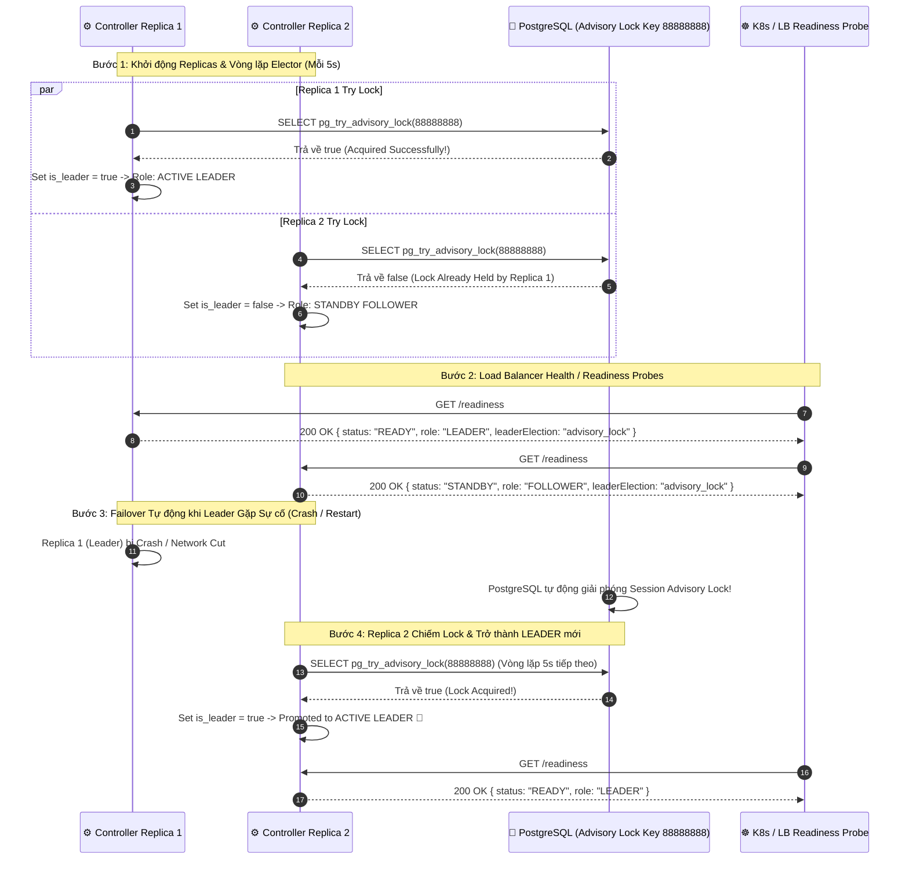

# End-to-End Controller HA Leader Election & Cluster State Sync Workflow Document

Tài liệu này mô tả chi tiết luồng **Bầu chọn Leader phân tán (Distributed Leader Election)** và **Đồng bộ Trạng thái Cluster trong Môi trường High Availability (HA Multi-Replica Deployment)** của `AegisNode Controller`.

---

## 1. Tổng quan Kiến trúc Controller High Availability (HA Architecture)

Khi triển khai `AegisNode Controller` trên môi trường Kubernetes hoặc Multi-Node Cluster, nhiều Controller Replicas (Pods/Instances) được khởi tạo đồng thời để đạt tính sẵn sàng cao (High Availability). 

Để tránh hiện tượng **Split-Brain** và **Duplicate Job Execution** (nhiều Controller cùng thực thi đè công việc), hệ thống sử dụng **PostgreSQL Transactional Advisory Locks (`pg_try_advisory_lock`)**:

```
+---------------------------------------------------------------------------------------+
|                                  CONTROLLER HA REPLICAS                               |
|                                                                                       |
|  +----------------------------+                 +------------------------------+  |
|  |    Controller Replica 1    |                 |     Controller Replica 2     |  |
|  |  Role: ACTIVE LEADER       |                 |     Role: STANDBY FOLLOWER   |  |
|  |  is_leader = true          |                 |     is_leader = false        |  |
|  +--------------+-------------+                 +--------------+---------------+  |
+-----------------|----------------------------------------------|------------------+
                  |                                              |
                  | Try Acquire Lock (Key ID: 88888888)          | Try Acquire Lock (Denied)
                  v                                              v
                      +--------------------------------------+
                      |      PostgreSQL HA Storage           |
                      |                                      |
                      |  - SELECT pg_try_advisory_lock(88888888)
                      |  - Single Active Advisory Lock       |
                      +--------------------------------------+
```

---

## 2. Luồng Trình tự Bầu chọn Leader (Mermaid Sequence Diagram)



---

## 3. Ma trận Quyền hạn & Phân chia Nhiệm vụ (Leader vs Follower Matrix)

| Chức năng / Công việc trong System | ACTIVE LEADER (`is_leader = true`) | STANDBY FOLLOWER (`is_leader = false`) |
| :--- | :--- | :--- |
| **Phục vụ REST API Read Only** (`GET /v1/nodes`) | ✅ Sẵn sàng phục vụ | ✅ Sẵn sàng phục vụ (Load Balanced) |
| **Nhận Node Heartbeats & Inventory** | ✅ Xử lý và ghi vào DB | ✅ Xử lý và ghi vào DB |
| **Phát hành Certificate & Ký CSR** | ✅ Thực thi ký X.509 | ❌ Từ chối / Chuyển hướng lên Leader |
| **Điều phối Job Orchestrator & Rollouts** | ✅ Lên lịch & Phân phối | ❌ Chờ ở trạng thái Standby |
| **Tự động Clean Up Offline Nodes** | ✅ Thực thi background worker | ❌ Bị vô hiệu hóa background worker |

---

## 4. Đặc tính Kỹ thuật của PostgreSQL Advisory Locks

> [!IMPORTANT]
> **Session-Level Lock (`pg_try_advisory_lock`):**
> PostgreSQL Advisory Locks liên kết trực tiếp với **Database Connection Session** của Controller. Khi một Leader Controller Replica bị crash hoặc sập mạng, kết nối TCP tới PostgreSQL ngắt -> PostgreSQL ngay lập tức giải phóng Advisory Lock `88888888` mà không cần chờ timeout phức tạp.

> [!TIP]
> **Khả năng Phục hồi Tự động (Zero Manual Intervention):**
> Vòng lặp `LeaderElector` chạy ngầm mỗi 5 giây (`tokio::time::sleep(5s)`). Ngay khi Leader cũ ngắt kết nối, Follower Replica tiếp theo sẽ chiếm được lock và nâng cấp vai trò thành Leader trong vòng dưới 5 giây.
