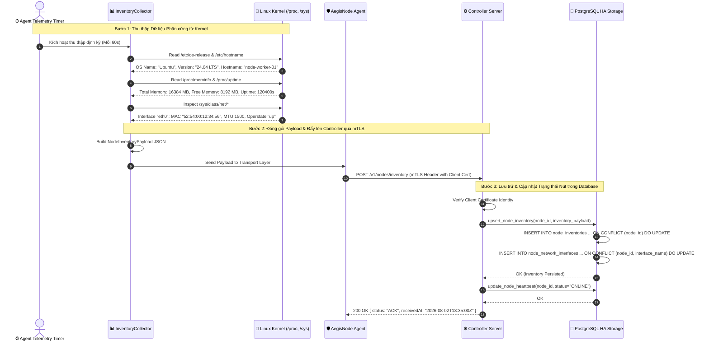

# End-to-End Node Inventory Collection & Telemetry Sync Workflow Document

Tài liệu này mô tả chi tiết luồng **Thu thập Thông tin Phần cứng & Hệ điều hành Linux Host (System & Network Inventory Collection)** và **Đồng bộ Báo cáo Trạng thái Định kỳ (Telemetry Heartbeat Sync)** từ Agent về Controller trong hệ thống `AegisNode`.

---

## 1. Tổng quan Kiến trúc Thu thập & Báo cáo Inventory (Architecture Overview)

Agent thu thập dữ liệu trực tiếp từ Kernel Linux qua Pseudo Filesystems (`/proc`, `/sys`) mà không phụ thuộc vào công cụ bên ngoài:

```
+---------------------------------------------------------------------------------------+
|                                    LINUX AGENT HOST                                   |
|                                                                                       |
|  Kernel Virtual Filesystems:                                                          |
|  - `/etc/os-release` & `/etc/hostname`    -> OS Name, Version, Hostname               |
|  - `/etc/machine-id`                     -> Hardware Machine UUID                     |
|  - `/proc/version`                       -> Linux Kernel Release Version              |
|  - `/proc/meminfo`                       -> Total Memory, Free Memory                 |
|  - `/proc/uptime`                        -> System Uptime Seconds                     |
|  - `/sys/class/net/`                     -> MAC Address, MTU, Operstate, Interface    |
+---------------------------------------------------------------------------------------+
                                           |
                                           v  `collect_system_inventory()`
+---------------------------------------------------------------------------------------+
|                                  INVENTORY COLLECTOR                                  |
|                                                                                       |
|  - Construct `NodeInventoryPayload` (System, Network Interfaces, Runtime Summary)     |
|  - Gửi Payload qua kênh mTLS v1.3 tới Controller API                                 |
+---------------------------------------------------------------------------------------+
                                           |
                                           v  POST /v1/nodes/inventory & /v1/nodes/heartbeat
+---------------------------------------------------------------------------------------+
|                                 CONTROLLER POSTGRES DB                                |
|                                                                                       |
|  - `nodes` (Heartbeat, Status: ONLINE / DEGRADED / OFFLINE)                           |
|  - `node_inventories` (Hardware, CPU, RAM, OS, Kernel)                                |
|  - `node_network_interfaces` (MAC, MTU, IPv4, IPv6, Rx/Tx Bytes)                      |
+---------------------------------------------------------------------------------------+
```

---

## 2. Luồng Tr trình tự End-to-End (Mermaid Sequence Diagram)



---

## 3. Cấu trúc Payload Dữ liệu (`NodeInventoryPayload`)

```json
{
  "nodeId": "f47ac10b-58cc-4372-a567-0e02b2c3d479",
  "system": {
    "hostname": "node-worker-01",
    "osName": "Ubuntu",
    "osVersion": "24.04 LTS",
    "kernelVersion": "Linux 6.8.0-31-generic #31-Ubuntu SMP",
    "cpuCores": 8,
    "totalMemoryMb": 16384,
    "freeMemoryMb": 8192,
    "uptimeSeconds": 120400,
    "machineId": "a1b2c3d4e5f67890"
  },
  "networkInterfaces": [
    {
      "interfaceName": "eth0",
      "macAddress": "52:54:00:12:34:56",
      "mtu": 1500,
      "operstate": "up",
      "ipv4Addresses": ["192.168.1.50/24"],
      "ipv6Addresses": ["fe80::5054:ff:fe12:3456/64"],
      "rxBytes": 104857600,
      "txBytes": 52428800
    }
  ],
  "runtime": {
    "agentVersion": "v0.1.1",
    "firewallBackend": "nftables",
    "activeRulesCount": 42
  }
}
```

---

## 4. Bảng Phân loại Trạng thái Nút (Node Health State Matrix)

Controller quản lý trạng thái của từng Node dựa trên tần suất nhận bản tin Telemetry Heartbeat:

| Trạng thái Node | Đăng ký Heartbeat Cuối cùng | Mô tả & Hành động của Controller |
| :--- | :--- | :--- |
| **`ONLINE`** | $< 60$ giây trước | Node đang hoạt động bình thường, sẵn sàng nhận policy rollouts. |
| **`DEGRADED`** | Từ $60$ đến $180$ giây trước | Node phản hồi chậm hoặc bị mất gói tin nhẹ; Cảnh báo trên Dashboard. |
| **`OFFLINE`** | $> 180$ giây trước (3 phút) | Controller đánh dấu Node bị mất kết nối; Không phân phối job mới. |
| **`REVOKED`** | Đã bị Admin thu hồi Cert | Node bị chặn ngay lập tức ở tầng mTLS, từ chối mọi API request. |
