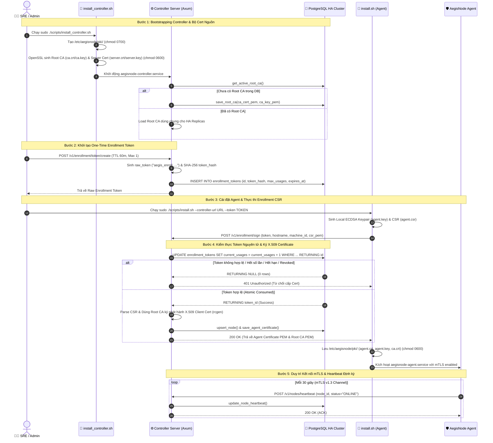

# End-to-End PKI & Node Enrollment Workflow Document

Tài liệu này mô tả chi tiết toàn bộ luồng **PKI (Public Key Infrastructure), Certificate Lifecycle, One-Time Enrollment Token & mTLS v1.3** cho nền tảng `AegisNode` trong môi trường **Cloud Native & High Availability (HA)**.

---

## 1. Tổng quan Kiến trúc PKI & mTLS (Architecture Overview)

Hệ thống PKI của `AegisNode` được thiết kế nhằm đảm bảo mọi Agent kết nối tới Controller đều phải được xác thực danh tính bằng **Chứng chỉ số X.509v3 Mã hóa (Cryptographic Certificate)** qua kênh giao tiếp bảo mật **mTLS v1.3**.

```
+-----------------------------------------------------------------------------------+
|                                  CONTROLLER HA CLUSTER                            |
|                                                                                   |
|  +----------------------------+                 +------------------------------+  |
|  |   Controller Replica 1     |                 |     Controller Replica 2     |  |
|  |  (Axum REST API / mTLS)    |                 |    (Axum REST API / mTLS)    |  |
|  +--------------+-------------+                 +--------------+---------------+  |
+-----------------|----------------------------------------------|------------------+
                  |                                              |
                  +----------------------+-----------------------+
                                         |
                                         v
                      +--------------------------------------+
                      |      PostgreSQL HA Cluster           |
                      |                                      |
                      |  - cluster_pki_ca (Root CA Source)   |
                      |  - enrollment_tokens (One-time)      |
                      |  - agent_certificates (Records)      |
                      |  - nodes (Inventory & Heartbeat)     |
                      +--------------------------------------+
                                         ^
                                         |  mTLS v1.3 Channel (Port 8080)
                                         |  Client Cert: /etc/aegisnode/pki/agent.crt
                                         v
+-----------------------------------------------------------------------------------+
|                                   LINUX AGENT HOST                                |
|                                                                                   |
|  - AegisNode Agent Service (systemd)                                             |
|  - Local PKI Storage: /etc/aegisnode/pki/ (agent.crt, agent.key, ca.crt)        |
+-----------------------------------------------------------------------------------+
```

---

## 2. Luồng Trình tự End-to-End (Mermaid Sequence Diagram)

Sơ đồ trình tự dưới đây thể hiện trọn vẹn từ lúc cài đặt Controller, sinh Root CA, khởi tạo Token gia nhập, đến khi Agent cấp phát chứng chỉ qua API và gửi Heartbeat định kỳ.



---

## 3. Chi tiết Bảng Dữ liệu & State Machine (Data Models & Lifecycle)

### 3.1. Các Bảng Cơ sở dữ liệu Quản lý PKI trong PostgreSQL

| Bảng SQL | Mục đích | Các Trường Quan trọng | Chiến lược HA & Bảo mật |
| :--- | :--- | :--- | :--- |
| **`cluster_pki_ca`** | Lưu trữ Root CA dùng chung cho toàn bộ Controller Replicas | `id`, `ca_cert_pem`, `ca_key_pem`, `active`, `created_at` | Mã hóa cert/key, index cờ `active = TRUE` duy nhất. |
| **`enrollment_tokens`** | Quản lý Token gia nhập một lần (One-Time Tokens) | `id`, `token_hash`, `max_usages`, `current_usages`, `revoked`, `expires_at` | Lưu **SHA-256 hash** thay vì token thô; Tiêu thụ bằng Atomic SQL. |
| **`agent_certificates`** | Quản lý Chứng chỉ số đã cấp cho từng Linux Agent Host | `serial_number`, `node_id`, `machine_id`, `hostname`, `cert_pem`, `expires_at`, `revoked` | Primary key `serial_number`; Hỗ trợ Revocation (Thu hồi nút). |

### 3.2. Bảng Trạng thái Vòng đời của Enrollment Token (Token State Transitions)

```
        +-------------------------------------------------------+
        |                    CREATED (Mới tạo)                   |
        +---------------------------+---------------------------+
                                    |
                                    v
     +------------------------------+------------------------------+
     |                       VALID (Hợp lệ)                        |
     | (revoked=FALSE, UtcNow < expires_at, current < max_usages)  |
     +--------------+---------------+--------------+---------------+
                    |                              |
     [Được tiêu thụ hết lượt]              [Đã hết hạn hoặc Admin hủy]
                    v                              v
     +--------------+---------------+--------------+---------------+
     |      CONSUMED / EXPIRED      |           REVOKED            |
     | (Không thể tái sử dụng)      | (Bị vô hiệu hóa lập tức)     |
     +------------------------------+------------------------------+
```

---

## 4. Cơ chế An toàn Bảo mật & Chống Lỗi Race Condition

> [!IMPORTANT]
> **Chống Race Condition khi tiêu thụ Enrollment Token (Atomic SQL Lock):**
> Khi nhiều Agent cùng sử dụng 1 Token đồng thời để xin cấp Cert, hệ thống sử dụng câu lệnh SQL Atomic `UPDATE ... RETURNING`:
> ```sql
> UPDATE enrollment_tokens
> SET current_usages = current_usages + 1
> WHERE token_hash = $1 
>   AND revoked = FALSE 
>   AND expires_at > CURRENT_TIMESTAMP 
>   AND current_usages < max_usages
> RETURNING id;
> ```
> PostgreSQL đảm bảo chỉ những giao dịch commit trước mới trả về `RETURNING id`. Các request đến sau sẽ không thể tiêu thụ quá số lượng `max_usages` cho phép.

> [!TIP]
> **Phân quyền Tối thiểu (Least Privilege) trên Filesystem Linux:**
> - Thư mục `/etc/aegisnode/pki/` đặt quyền `0700` thuộc `aegisnode:aegisnode` (trên Controller) hoặc `root:root` (trên Agent).
> - Tất cả Private Keys (`ca.key`, `server.key`, `agent.key`) bắt buộc đặt quyền `0600` (Không người dùng nào khác ngoài Process Owner được đọc).

> [!WARNING]
> **Bảo vệ chống Replay Attack:**
> Token thô (`aegis_enroll_...`) chỉ tồn tại ngắn hạn trên giao diện điều khiển hoặc lệnh khởi tạo. Controller **không bao giờ lưu raw token** vào Database mà chỉ lưu bản băm SHA-256 (`token_hash`), ngăn ngừa việc lộ Token qua DB Dumps.

---

## 5. Tóm tắt Kịch bản Cài đặt & Dọn dẹp (Automation Scripts Summary)

| Script Path | Mục đích / Vai trò | Các File Sinh ra / Tác động |
| :--- | :--- | :--- |
| **`scripts/install_controller.sh`** | Cài đặt Controller & Bootstrapping Bộ Cert Nguồn | `/etc/aegisnode/pki/ca.crt`, `ca.key`, `server.crt`, `server.key`, `controller.yaml`, `aegisnode-controller.service` |
| **`scripts/install.sh`** | Cài đặt Agent, Sinh Key/CSR & Lấy Cert được ký | `/etc/aegisnode/pki/agent.crt`, `agent.key`, `ca.crt`, `agent.yaml`, `aegisnode-agent.service` |
| **`scripts/uninstall.sh`** | Gỡ bỏ An toàn & Clean up Chứng chỉ | Dừng systemd services, xóa binary. Khi truyền `--purge` sẽ xóa sạch thư mục `/etc/aegisnode/pki/` |
