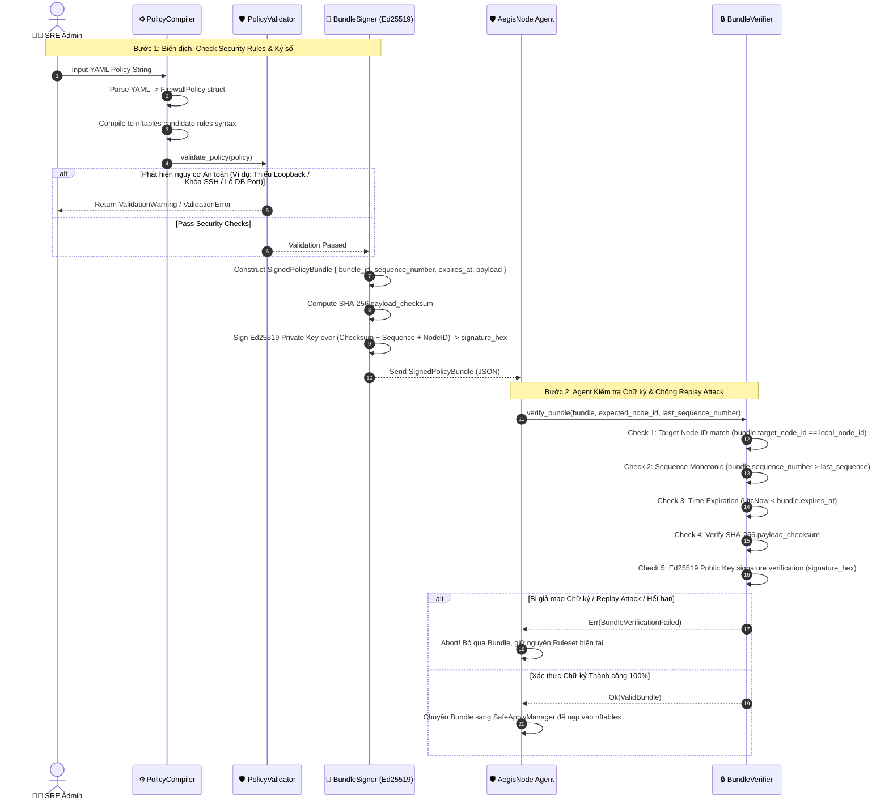

# End-to-End Policy Compilation, Security Validation & Cryptographic Bundle Signing Workflow Document

Tài liệu này mô tả chi tiết quy trình **Biên dịch Cấu hình (Policy Compilation)**, **Xác thực An toàn Mạng (Security Rule Validation)** và **Ký số Mã hóa Chống Giả mạo / Replay Attack (Ed25519 Cryptographic Bundle Signing)** trong hệ thống `AegisNode`.

---

## 1. Tổng quan Kiến trúc Biên dịch & Ký số Policy (Architecture Overview)

Mọi chính sách tường lửa (Firewall Policy) dạng YAML/HCL từ Admin/Controller trước khi được áp dụng xuống Linux Agent Host phải đi qua 3 công đoạn bảo vệ nghiêm ngặt:

```
+---------------------------------------------------------------------------------------+
|                                  CONTROLLER POLICY PIPELINE                           |
|                                                                                       |
|  1. HCL/YAML Policy Input                                                             |
|  2. Policy Compiler (HCL/YAML -> FirewallPolicy Struct -> nftables Syntax)            |
|  3. Policy Validator (Safety Check: SSH lockout, loopback, database exposure)          |
|  4. Deterministic Policy Hash & Payload Checksum Generation (SHA-256)                 |
|  5. Ed25519 Bundle Signer (Ký số SignedPolicyBundle bằng Private Key của Controller)  |
+---------------------------------------------------------------------------------------+
                                           |
                                           v  Distribution via mTLS Channel
+---------------------------------------------------------------------------------------+
|                                    LINUX AGENT HOST                                   |
|                                                                                       |
|  1. Ed25519 Bundle Verifier (Kiểm tra Chữ ký số bằng Controller Public Key)           |
|  2. Replay Attack & Expiration Guard:                                                 |
|     - Check `sequence_number > last_sequence`                                         |
|     - Check `target_node_id == local_node_id`                                         |
|     - Check `UtcNow < expires_at`                                                     |
|  3. Execute Safe Apply Transaction vào nftables                                       |
+---------------------------------------------------------------------------------------+
```

---

## 2. Luồng Trình tự End-to-End (Mermaid Sequence Diagram)



---

## 3. Cấu trúc Bundle & Cryptographic Signature (`SignedPolicyBundle`)

### 3.1. Structure JSON Payload của `SignedPolicyBundle`
```json
{
  "bundleId": "bundle-9b1deb4d-3b7d-4bad-9bdd-2b0d7b3dcb6d",
  "targetNodeId": "node-worker-01",
  "policyVersion": "v1.4.2",
  "sequenceNumber": 142,
  "issuedAt": "2026-08-02T13:00:00Z",
  "expiresAt": "2026-08-02T13:15:00Z",
  "controllerId": "controller-01",
  "payloadChecksum": "e3b0c44298fc1c149afbf4c8996fb92427ae41e4649b934ca495991b7852b855",
  "signatureHex": "7d8f9b2a1c0d4e5f6a7b8c9d0e1f2a3b4c5d6e7f8a9b0c1d2e3f4a5b6c7d8e9f...",
  "firewallPolicy": {
    "apiVersion": "aegis.network/v1alpha1",
    "kind": "FirewallPolicy",
    "metadata": {
      "name": "Web Server Strict Policy",
      "version": 1
    },
    "defaults": {
      "input": "Drop",
      "output": "Accept",
      "forward": "Drop"
    },
    "rules": [
      {
        "name": "allow-ssh",
        "action": "Accept",
        "protocol": "tcp",
        "port": 22
      }
    ]
  }
}
```

---

## 4. Các Quy tắc Kiểm định An toàn Mạng (Policy Validation Rules)

Trước khi ký số, `PolicyValidator` tự động kiểm tra các lỗi cấu hình nguy hiểm:

| Tên Rule kiểm định | Loại Cảnh báo/Lỗi | Lý do Bảo mật |
| :--- | :--- | :--- |
| **`check_missing_loopback`** | `SecurityWarning` | Giao diện Loopback (`lo`) bị khóa làm hỏng Inter-Process Communication (IPC) nội bộ host. |
| **`check_ssh_lockout`** | `ValidationError` | Policy thiết lập default DROP input nhưng quên mở port 22/SSH -> Khiến Admin bị ngắt kết nối remote. |
| **`check_database_exposed`** | `SecurityWarning` | Port Postgres (5432) hoặc MySQL (3306) bị mở công khai ra 0.0.0.0/0 mà không có CIDR restriction. |
| **`check_conflicting_rules`** | `ValidationError` | Có 2 rules trùng thông số nhưng một rule ACCEPT và một rule DROP đứng liền kề. |

---

## 5. Phòng chống Tấn công Replay Attack & Giả mạo Bundle

> [!IMPORTANT]
> **Chữ ký số Ed25519 (Elliptic-curve Cryptography):**
> Ed25519 cung cấp khả năng xác thực chữ ký cực nhanh với độ an toàn cao. Agent chỉ tin tưởng Bundle nếu chữ ký số `signature_hex` khớp với Public Key của Controller đã được cấp phát trước đó.

> [!WARNING]
> **Chống Tấn công Phát lại (Monotonic Sequence Number Fence):**
> Kẻ tấn công trên mạng không thể bắt lại Bundle cũ hợp lệ từ quá khứ để phát lại (Replay Attack) nhằm hạ phiên bản Policy. Agent duy trì cờ `last_sequence_number` và chỉ chấp nhận Bundle có `sequence_number > last_sequence_number`.
