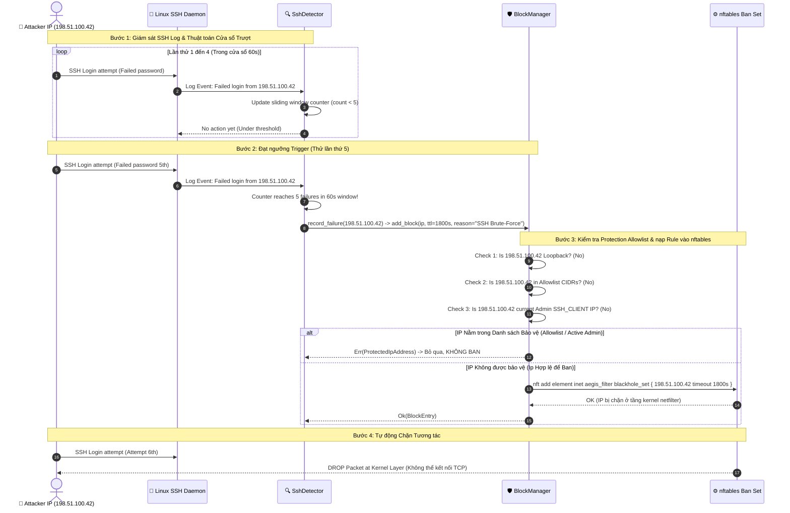

# End-to-End Dynamic SSH Brute-Force Detection & Automated IP Banlist Workflow Document

Tài liệu này mô tả chi tiết luồng **Giám sát SSH thời gian thực (SSH Log Monitoring)**, **Thuật toán cửa sổ trượt (Sliding Window Algorithm)** phát hiện tấn công dò quét mật khẩu và **Tự động Chặn IP vi phạm (Dynamic IP Banlist)** trong hệ thống `AegisNode`.

---

## 1. Tổng quan Kiến trúc Giám sát & Chặn IP (Architecture Overview)

Hệ thống kết hợp giữa `SshDetector` và `BlockManager` để phát hiện kẻ tấn công và chặn IP ở tầng kernel `nftables` một cách tự động:

```
+---------------------------------------------------------------------------------------+
|                                    LINUX HOST LOG STREAM                              |
|                                                                                       |
|  - `/var/log/auth.log` / Systemd Journald                                             |
|  - Log entry: "Failed password for root from 198.51.100.42 port 45123 ssh2"          |
+---------------------------------------------------------------------------------------+
                                           |
                                           v
+---------------------------------------------------------------------------------------+
|                                      SSH DETECTOR                                     |
|                                                                                       |
|  - Sliding Window Tracking: Thu thập số lần lặp lỗi per IP trong cửa sổ T giây       |
|  - Điều kiện Ban: count >= 5 failures trong window 60s                                |
+---------------------------------------------------------------------------------------+
                                           |
                                           v  Trigger Block Event
+---------------------------------------------------------------------------------------+
|                                     BLOCK MANAGER                                     |
|                                                                                       |
|  1. Safe Allowlist Check (Bảo vệ tuyệt đối):                                          |
|     - Check Loopback (`127.0.0.1`)                                                    |
|     - Check Explicit Allowlist CIDRs (VD: `10.50.0.0/16`)                             |
|     - Check Active Admin SSH Session IP (`$SSH_CLIENT`)                               |
|  2. If IP IS NOT protected -> Apply Dynamic Rule to nftables set                      |
|  3. Set Ban TTL (VD: 1800 giây = 30 phút hoặc Vĩnh viễn)                              |
+---------------------------------------------------------------------------------------+
```

---

## 2. Luồng Trình tự End-to-End (Mermaid Sequence Diagram)



---

## 3. Các Cơ chế Bảo vệ Tránh Chặn Nhầm Admin (Safety Guards)

Để tránh tình trạng chính Admin gõ sai mật khẩu bị hệ thống tự động khóa (Lockout Admin):

| Cơ chế Bảo vệ | Logic Kiểm tra | Kết quả Xử lý |
| :--- | :--- | :--- |
| **Loopback Protection** | `ip == "127.0.0.1" \|\| ip == "::1"` | Luôn luôn từ chối lệnh BAN (`Err(ProtectedIpAddress)`). |
| **Explicit Allowlist CIDRs** | `allowlist.iter().any(\|cidr\| cidr.contains(ip))` | Các dải IP mạng nội bộ/VPN được bảo vệ tuyệt đối. |
| **Active Session IP Guard** | Đọc biến môi trường `$SSH_CLIENT` của session hiện tại | IP của Admin đang mở phiên làm việc SSH hiện tại sẽ KHÔNG BAO GIỜ bị chặn. |

---

## 4. Struct Cấu hình Blocker (`BlockerConfig`)

```json
{
  "enabled": true,
  "sshDetector": {
    "enabled": true,
    "maxFailures": 5,
    "windowSeconds": 60,
    "banDurationSeconds": 1800
  },
  "allowlist": [
    "127.0.0.1/32",
    "10.50.0.0/16",
    "192.168.1.0/24"
  ]
}
```
