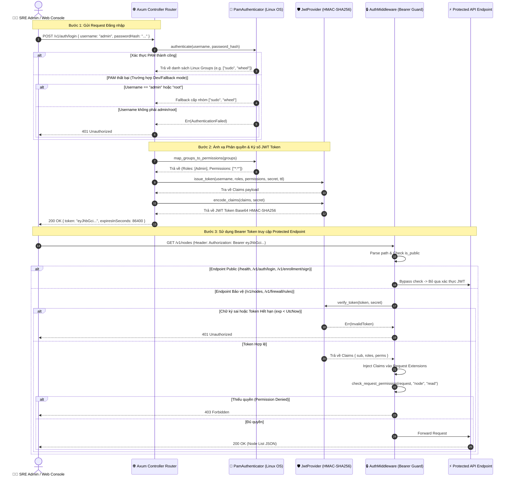

# End-to-End User Authentication & JWT RBAC Workflow Document

Tài liệu này mô tả chi tiết luồng **Xác thực Đăng nhập (User Authentication)**, **Tích hợp Linux OS PAM (Pluggable Authentication Modules)**, **Cấp phát JWT Stateless Token** và **Phân quyền Phân tán theo Vai trò (Fine-grained RBAC `object:behavior`)** trong hệ thống `AegisNode`.

---

## 1. Tổng quan Kiến trúc Xác thực (Authentication Architecture)

Hệ thống xác thực người dùng của `AegisNode` sử dụng mô hình **Stateless JWT Authentication** kết hợp với cơ chế **Linux System PAM Authentication** (Cockpit/Sudo Style), giúp tận dụng tài khoản người dùng hệ thống Linux hiện có mà không làm phát sinh điểm nghẽn trạng thái (stateful session bottleneck) trong môi trường **Cloud Native & High Availability (HA)**.

```
+---------------------------------------------------------------------------------------+
|                                    SRE ADMIN / CLIENT                                 |
|                                                                                       |
|  1. POST /v1/auth/login { username, password_hash }                                  |
|  2. Nhận Bearer JWT Token { token, expires_in_seconds }                               |
|  3. Gửi Request kèm Header: "Authorization: Bearer <token>"                          |
+---------------------------------------------------------------------------------------+
                                           |
                                           v
+---------------------------------------------------------------------------------------+
|                              CONTROLLER REST API SERVER                               |
|                                                                                       |
|  +----------------------------+     +-------------------+     +--------------------+  |
|  |    login_handler           | --> |  PamAuthenticator | --> |    JwtProvider     |  |
|  |  (POST /v1/auth/login)     |     |  (Linux OS PAM)   |     |   (HMAC-SHA256)    |  |
|  +----------------------------+     +-------------------+     +--------------------+  |
|                                                                          |            |
|  +--------------------------------------------------------------------+  |            |
|  |               parse_bearer_token_middleware                        | <+            |
|  |  - Verify JWT Signature & Expiration                              |               |
|  |  - Extract Claims (sub, roles, perms) -> Request Extensions      |               |
|  +--------------------------------------------------------------------+               |
|                                   |                                                   |
|                                   v                                                   |
|  +--------------------------------------------------------------------+               |
|  |              RBAC Permission Guard (check_request_permission)       |               |
|  |  - Evaluate: `object:behavior` (Ví dụ: "firewall:write")             |               |
|  +--------------------------------------------------------------------+               |
+---------------------------------------------------------------------------------------+
```

---

## 2. Luồng Trình tự End-to-End Đăng nhập & RBAC Guard (Mermaid Sequence Diagram)

Sơ đồ trình tự thể hiện toàn bộ vòng đời từ lúc gửi Username/Password, xác thực PAM Linux, mã hóa JWT Token, đến khi dùng Token truy cập API được bảo vệ.



---

## 3. Cấu trúc Dữ liệu & Bảng Ánh xạ Phân quyền (Data Models & Mapping Matrix)

### 3.1. Requests & Responses Schemas

#### Request Payload (`LoginRequest`)
```json
{
  "username": "admin",
  "passwordHash": "e3b0c44298fc1c149afbf4c8996fb92427ae41e4649b934ca495991b7852b855"
}
```

#### Response Payload (`LoginResponse`)
```json
{
  "token": "eyJhbGciOiJIUzI1NiIsInR5cCI6IkpXVCJ9...",
  "expiresInSeconds": 86400
}
```

#### Cấu trúc JWT Claims Payload Inside Token
```json
{
  "sub": "admin",
  "roles": ["Admin"],
  "permissions": [
    "firewall:read",
    "firewall:write",
    "node:read",
    "node:write",
    "audit:read"
  ],
  "exp": 1785680000,
  "iat": 1785593600
}
```

---

### 3.2. Bảng Ánh xạ từ Linux Groups sang AegisNode Roles & Permissions

Hệ thống tự động đọc thông tin Linux Groups của User thông qua PAM và áp ánh xạ phân quyền theo nguyên tắc **Least Privilege**:

| Linux System Group | AegisNode Role | Danh sách Permissions Cấp phát | Mục đích / Quyền hạn |
| :--- | :--- | :--- | :--- |
| `sudo`, `wheel`, `root` | `Role::Admin` | `*:*` (All Resources & Actions) | Quản trị viên cao nhất hệ thống (Full Control). |
| `aegis-operator`, `netdev` | `Role::Operator` | `firewall:read`, `firewall:write`, `node:read`, `systemd:write` | Kỹ sư vận hành mạng, tạo và apply firewall rules. |
| `aegis-auditor` | `Role::Auditor` | `audit:read`, `node:read`, `firewall:read` | Đội kiểm toán an toàn thông tin (Chỉ đọc nhật ký audit). |
| `aegis-viewer`, `users` | `Role::Viewer` | `*:read` (Tất cả quyền đọc ngoại trừ write/delete) | Người dùng quan sát metrics & dashboard trạng thái. |

---

## 4. Kiểm thực An toàn Bảo mật & Kiến trúc HA (Security & HA Best Practices)

> [!IMPORTANT]
> **Tối ưu Cloud Native HA (Stateless Architecture):**
> Vì JWT chứa toàn bộ thông tin nhận dạng (`sub`), vai trò (`roles`), và danh sách quyền (`permissions`) được ký mã hóa HMAC-SHA256, Controller Server **không cần duy trì Session State trong Memory hoặc Redis**. Bất kỳ Controller Replica nào trong HA Cluster cũng có thể verify chữ ký Token một cách độc lập nếu dùng chung `auth_secret`.

> [!TIP]
> **Cấu hình Quản lý Khóa Bí mật (`auth_secret`):**
> Trong môi trường Production Cloud Native (Kubernetes / Docker Swarm):
> - Giá trị `auth_secret` không được để chuỗi mặc định.
> - Cần inject qua biến môi trường `CONTROLLER_SERVER_AUTH_SECRET` từ Kubernetes Secret / HashiCorp Vault.

> [!WARNING]
> **Bảo vệ chống Brute-Force & Replay Attack:**
> 1. Thời gian sống của Token (`session_ttl_seconds`) nên đặt tối đa 24 giờ (`86400s`).
> 2. Đăng nhập qua PAM cần kết hợp với `fail2ban` hoặc Rate Limiter middleware ở tầng API Gateway để ngăn chặn tấn công dò quét mật khẩu người dùng Linux host.
